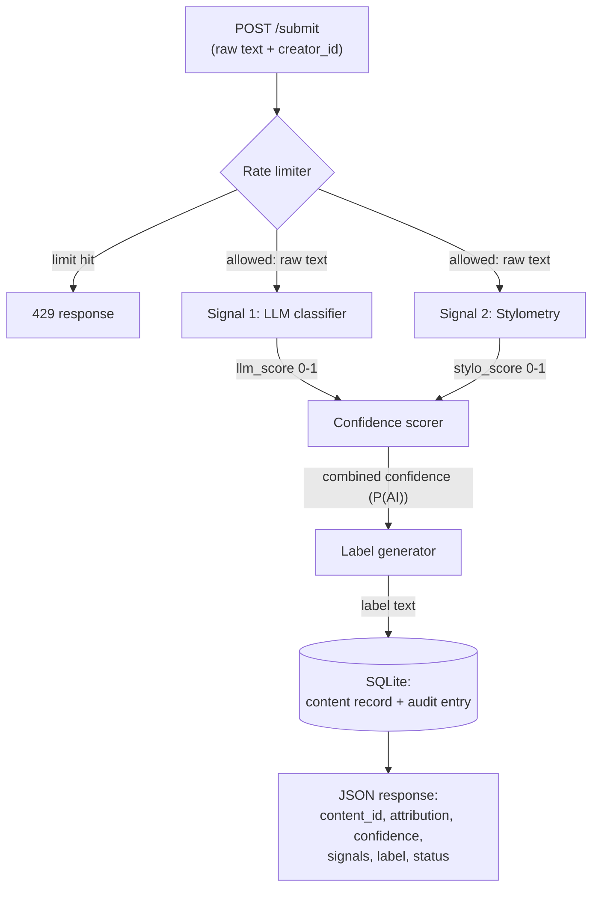

# Provenance Guard

A backend that classifies whether submitted text was written by a human or generated by AI, scores its confidence, surfaces a plain-language transparency label, and gives creators a path to appeal.


## How to run

```bash
python -m venv .venv
source .venv/bin/activate
pip install -r requirements.txt
echo "GROQ_API_KEY=your_key_here" > .env
python app.py                              # serves on http://localhost:5000
```

Three endpoints:

- `POST /submit` accepts `{text, creator_id}` and returns the classification (attribution, confidence, both signal scores, and the transparency label).
- `POST /appeal` accepts `{content_id, creator_reasoning, evidence_url?}` and puts the content under review.
- `GET /log` returns the structured audit log.


Example:

```bash
curl -s -X POST http://localhost:5000/submit \
  -H "Content-Type: application/json" \
  -d '{"text": "The sun dipped below the horizon. I sat on the porch, coffee in hand.", "creator_id": "test-user-1"}'
```


## Architecture

A submission enters `POST /submit` and clears the rate limiter. It then runs through two independent detectors, an LLM classifier (semantic) and stylometric heuristics (structural). Their two 0-1 scores are combined by a weighted average into one confidence score, the system's probability that the text is AI-generated. That score maps to a transparency label and is written to a SQLite content record plus a structured audit entry before the JSON response returns. An appeal enters `POST /appeal` with the `content_id` and the creator's reasoning, flips that content record's status to `under_review`, and logs the appeal beside the original classification so a human reviewer can see both together.




## Detection signals

The pipeline uses two genuinely independent signal types, one semantic and one structural, so a weakness in one is covered by the other. The structural type is itself three signals (sentence-length variance, type-token ratio, and punctuation density), so four signals contribute in total. The LLM score and the combined stylometry score are returned alongside the overall confidence.

### Signal 1: LLM classifier (semantic)

Groq `llama-3.3-70b-versatile` reads the text and judges how AI it sounds, weighing semantic and stylistic coherence holistically. It returns structured JSON via JSON mode, `{ "llm_score": 0.0-1.0, "reason": "<one sentence>" }`, where `llm_score` is the model's estimated probability that the text is AI-generated. A parse failure triggers a retry with the fallback model `openai/gpt-oss-120b`, and if that also fails the signal treats the text as uncertain (`llm_score = 0.5`) and logs the failure, because a confident wrong verdict is the costly error.

I chose it because it captures meaning, tone, and register that no surface statistic can. Its blind spot is that it is steerable by framing, fooled by lightly-edited AI or an unusual-but-genuine human voice, and non-deterministic across calls.

### Signal 2: Stylometric heuristics (structural)

Pure-Python heuristics measure how statistically regular the text is. Three metrics each map to a 0-1 AI-leaning sub-score and combine into one `stylo_score`:

- Sentence-length variance: AI is more uniform, so low variance leans AI.
- Type-token ratio (unique / total words): AI repeats common phrasing, so low TTR leans AI.
- Punctuation density: informal human writing is more expressive, so low variation leans AI.

Models optimize for coherent, uniform output, so this structural regularity separates them from naturally variable human writing. I chose it because it is cheap, deterministic, and independent of the LLM, which makes the combination more informative than either alone. Its blind spot is that it cannot read meaning, it penalizes legitimately uniform or formal human writing such as academic prose or non-native English, and it is unreliable on very short texts.

**What would I change for real deployment?**

For real deployment, I would calibrate the stylometry reference windows on a labeled corpus instead of hand-set provisional values, and add more independent signals (for example a perplexity or burstiness measure) so no single heuristic carries much weight.


## Confidence scoring

A single `confidence` value in `[0, 1]` is the system's confidence that the content is AI-generated: `0.0` is certainly human, `0.5` is maximally uncertain, and `1.0` is certainly AI. It is a weighted average that trusts the holistic signal more, so stylometry informs the result but cannot dominate it:

```
confidence = 0.7 * llm_score + 0.3 * stylo_score
```

The transparency label is a direct function of this one number, so a `0.51` and a `0.95` produce different labels, not just different numbers. Three bands map the score to a label:

| `confidence` | Band (`attribution`) | Meaning |
| :--- | :--- | :--- |
| Under `0.35` | `likely_human` | confident human |
| `0.35 - 0.70` | `uncertain` | inconclusive |
| Over `0.70` | `likely_ai` | confident AI |

The bands are asymmetric on purpose: it takes strong evidence to call something AI, so a borderline score like `0.68` lands in Uncertain rather than accusing a human. `confidence` here means confidence that the content is AI-generated, not confidence in the verdict, so a strongly-human result reads as a low number and still carries the `likely_human` label.

**How did I validate it?**

I ran four deliberately chosen inputs (clearly AI, clearly human, formal-human borderline, lightly-edited-AI borderline) and confirmed the clearly-AI and clearly-human cases land far apart in opposite bands. The borderline cases land closer to the boundary, and as Known limitations describes, the formal-human one can even cross into `likely_ai`, the false positive the appeal path exists to handle. Both signal scores are printed separately so I can see which one moves the result.

**Two real submissions with noticeably different confidence** (Groq `llama-3.3-70b-versatile`):

1. High-confidence AI (`confidence = 0.7393`):

```json
{
  "attribution": "likely_ai",
  "confidence": 0.7393,
  "signals": { "llm_score": 0.8, "stylo_score": 0.5977 },
  "reason": "The passage exhibits a high degree of semantic coherence and generic phrasing, with a tone that is uniformly formal and objective, which is consistent with AI-generated text.",
  "label": "🤖 Likely AI-generated. ..."
}
```

2. Low-confidence / human (`confidence = 0.2645`):

```json
{
  "attribution": "likely_human",
  "confidence": 0.2645,
  "signals": { "llm_score": 0.2, "stylo_score": 0.415 },
  "reason": "The text's informal tone, personal experience, and specific criticisms suggest a human writer.",
  "label": "✍️ Likely human-written. ..."
}
```

**What would I change for real deployment?**

The `0.7/0.3` weights and the `0.35/0.70` thresholds are reasoned defaults, not calibrated ones. With a labeled dataset I would fit them to a target false-positive rate, and possibly set per-content-type thresholds (poetry behaves differently from prose).


## Transparency label

The label returned to the reader is chosen by band. The three variants use different wording, not just a different number, and avoid jargon so a non-technical reader understands the result.

| Band | Label text |
| :--- | :--- |
| `likely_ai` | 🤖 Likely AI-generated. Our analysis suggests this text was probably produced with significant help from an AI writing tool. This is an automated estimate, not a certainty. If you wrote it yourself, you can appeal. |
| `uncertain` | ❓ Inconclusive. Human writing like an AI, or AI writing like a human? You've got us, no verdict on this one. |
| `likely_human` | ✍️ Likely human-written. Our analysis found no strong signs of AI generation in this text. |


## Appeals workflow

A creator can appeal their own classified submission by sending its `content_id` (returned by `/submit`) together with `creator_reasoning`, a free-text explanation of why they believe the classification is wrong. They may optionally include an `evidence_url` pointing to a Google Docs or OneDrive document that shows the full editing history.

The system validates that the `content_id` exists, sets the content record's `status` to `under_review`, appends an audit-log entry that references the original classification with the reasoning, any evidence link, and a timestamp, and returns a confirmation. There is no automated re-classification. A reviewer opening the queue sees, through `GET /log`, the original classification entry alongside the appeal entry for that `content_id`. The appeal in the audit log below shows this end to end.


## Rate limiting

`POST /submit` is rate limited with Flask-Limiter at:

- 2 per minute
- 10 per hour
- 50 per day

These are deliberately strict because they match normal use on a writing platform. A creator drafts and edits over minutes, so 2 per minute comfortably covers a genuine resubmit or two while making a scripted flood expensive. 10 per hour caps sustained abuse from a single address within one session, and 50 per day exceeds even a prolific creator's daily output, so anything past it is almost certainly automated. They are also easy to show in a demo.

Four rapid requests against the `2 per minute` limit:

```
request 1: 200
request 2: 200
request 3: 429
request 4: 429
```

The 429 response is structured, not an HTML error page:

```json
{
  "error": "Rate limit exceeded. Please slow down and try again later.",
  "limit": "2 per 1 minute"
}
```


## Audit log

Every decision is written to a SQLite audit log (`audit_log` table). A `classification` row is written on every `/submit`, and an `appeal` row is appended on every `/appeal` with the same `content_id`, so `GET /log` shows the appeal beside the original classification. Each entry carries the attribution, confidence, and timestamp, and both signal scores are kept so the combined confidence is reconstructable.

The log below has four entries: three classifications and one appeal. The appeal (id 4) sits next to its original classification (id 3) for the same `content_id`, with the creator's reasoning and evidence link captured and the status moved to `under_review`. This is the formal-human submission discussed under Known limitations.

```json
{
  "entries": [
    {
      "id": 4,
      "event": "appeal",
      "content_id": "1d278213-6923-4c18-a8a8-d1729a3ddccf",
      "creator_id": "creator-formal_human",
      "timestamp": "2026-06-28T21:44:44.995376+00:00",
      "attribution": "likely_ai",
      "confidence": 0.7381,
      "llm_score": 0.8,
      "stylo_score": 0.5938,
      "status": "under_review",
      "appeal_reasoning": "I wrote this myself. English is my second language, so my style reads more formal than usual, which I think pushed the score up.",
      "appeal_evidence_url": "https://docs.google.com/document/d/EXAMPLE/edit"
    },
    {
      "id": 3,
      "event": "classification",
      "content_id": "1d278213-6923-4c18-a8a8-d1729a3ddccf",
      "creator_id": "creator-formal_human",
      "timestamp": "2026-06-28T21:44:44.985925+00:00",
      "attribution": "likely_ai",
      "confidence": 0.7381,
      "llm_score": 0.8,
      "stylo_score": 0.5938,
      "status": "classified",
      "appeal_reasoning": null,
      "appeal_evidence_url": null
    },
    {
      "id": 2,
      "event": "classification",
      "content_id": "b1304fd8-d003-4ad7-9f4a-d3dd6044cd05",
      "creator_id": "creator-clearly_human",
      "timestamp": "2026-06-28T21:44:44.601911+00:00",
      "attribution": "likely_human",
      "confidence": 0.2645,
      "llm_score": 0.2,
      "stylo_score": 0.415,
      "status": "classified",
      "appeal_reasoning": null,
      "appeal_evidence_url": null
    },
    {
      "id": 1,
      "event": "classification",
      "content_id": "f6bc0d6e-1b81-41b4-bad2-e04e7b099453",
      "creator_id": "creator-clearly_AI",
      "timestamp": "2026-06-28T21:44:44.250511+00:00",
      "attribution": "likely_ai",
      "confidence": 0.7393,
      "llm_score": 0.8,
      "stylo_score": 0.5977,
      "status": "classified",
      "appeal_reasoning": null,
      "appeal_evidence_url": null
    }
  ]
}
```

## Known limitations

The system will most likely struggle with academic writing, legal documents, or formal prose by a non-native English speaker. Low sentence-length variance and lower type-token ratio drive the stylometry score high, and the even, formal register nudges the LLM up too, so the combined score creeps toward the AI band even though a human wrote it.

This is not hypothetical: in the capture above, a formal paragraph about monetary policy scored `confidence = 0.7381` and was labeled `likely_ai`, a genuine false positive.

The asymmetric `0.70` threshold is meant to catch this, but a confident LLM combined with a high structural score can still push a real human just over the line, which is exactly why the appeal path exists. A short, repetitive poem fails for the same structural reason.


## Spec reflection

**One way the spec helped:**

Writing the signal output shapes, the `0.7/0.3` combine, the `0.35/0.70` thresholds, and the exact label text in `planning.md` before any code meant each implementation milestone had a concrete target. The AI-generated functions matched intent on the first pass, so review was mostly confirming the code against the spec rather than redesigning it.

**One way the implementation diverged:**

`planning.md` specifies that the three stylometry metrics are averaged equally.

During Milestone 4 testing, I saw that the type-token ratio saturated on short submissions: it was nearly identical for clearly-AI and clearly-human text at these lengths, so an equal third of the vote just added a flat offset and diluted the two metrics that actually discriminate.

I overrode the equal average and down-weighted TTR to a `3:2:3` weighting (`sentence-length variance : TTR : punctuation`), so it stays a light tie-breaker for genuinely repetitive text rather than an equal vote.


## AI usage

1. **Building the submission endpoint and the LLM signal**

   I gave Claude the Detection Signals section (Signal 1) and the architecture diagram from `planning.md`, and directed it to implement the Flask app skeleton with a `POST /submit` route stub and the first signal function returning `{llm_score, reason}`. It produced a working Flask app with the `/submit` route and a Groq-backed classifier. I **overrode** the failure handling to add a fallback model (`openai/gpt-oss-120b`) that retries on a parse failure before defaulting to an uncertain `0.5`, so a parser break fails safe instead of emitting a confident wrong verdict. I later **extended** the appeal contract with an optional `evidence_url` so a creator can attach an editing-history link.

2. **Building the stylometry signal and confidence scoring**

   I gave Claude the Detection Signals (Signal 2) and Confidence Scoring sections plus the diagram, and directed it to implement the stylometry function and the logic that combines both signals. It produced a stylometry signal that averaged its three metrics equally. After testing on short sample texts I saw the type-token ratio saturate, with near-identical scores for AI and human at those lengths, so I **overrode** the equal average and down-weighted TTR to a `3:2:3` weighting, then verified on the four test inputs that the clearly-AI and clearly-human cases still land in opposite bands.

## Stretch features

### Ensemble detection

The detection pipeline is an ensemble of four signals across two types: the semantic LLM classifier, and three structural stylometric signals (sentence-length variance, type-token ratio, and punctuation density). Each is scored separately, then combined by a hierarchical weighted average. The three stylometric signals first combine into `stylo_score` with a 3:2:3 weighting (variance `0.375`, TTR `0.25`, punctuation `0.375`), and that combines with the LLM:

```
confidence = 0.7 * llm_score + 0.3 * stylo_score
```

The effective ensemble weights are LLM `0.70`, variance `0.1125`, punctuation `0.1125`, and TTR `0.075`.

**How are conflicts resolved?**

The LLM holds the majority weight because it is the only signal that reads meaning, so no single structural signal can flip its verdict. A structural signal that disagrees with the LLM pulls a borderline result toward Uncertain rather than reversing it, and the asymmetric `0.70` threshold keeps a contested case out of `likely_ai` and favors the human. TTR carries the smallest weight because it saturates on short text.

**Individual signal scores alongside the ensemble result:**

For the high-confidence AI example above, `signal_stylometry` exposes each sub-score:

| Signal | Score | Weight |
| :--- | :--- | :--- |
| LLM classifier | 0.800 | 0.70 |
| Sentence-length variance | 0.594 | 0.1125 |
| Type-token ratio | 0.000 | 0.075 |
| Punctuation density | 1.000 | 0.1125 |
| **Ensemble `confidence`** | **0.7393** | |

As part of this stretch, `/submit` now also returns an additive `ensemble_signals` field exposing these individual scores on every request. The required `signals` field (`llm_score`, `stylo_score`) is unchanged; this is extra:

```json
"ensemble_signals": {
  "llm": 0.8,
  "stylometry_variance": 0.594,
  "stylometry_type_token_ratio": 0.0,
  "stylometry_punctuation": 1.0
}
```

### Analytics dashboard

A read-only `GET /analytics` endpoint aggregates the existing audit log into a metrics summary.

The view reports three metrics: the detection pattern (the share of each verdict), the appeal rate (appeals divided by classifications), and the average confidence across classifications. Captured from the audit log shown above:

```json
{
  "total_classifications": 3,
  "total_appeals": 1,
  "detection_pattern": { "likely_ai": 0.6667, "uncertain": 0.0, "likely_human": 0.3333 },
  "appeal_rate": 0.3333,
  "average_confidence": 0.5806
}
```
