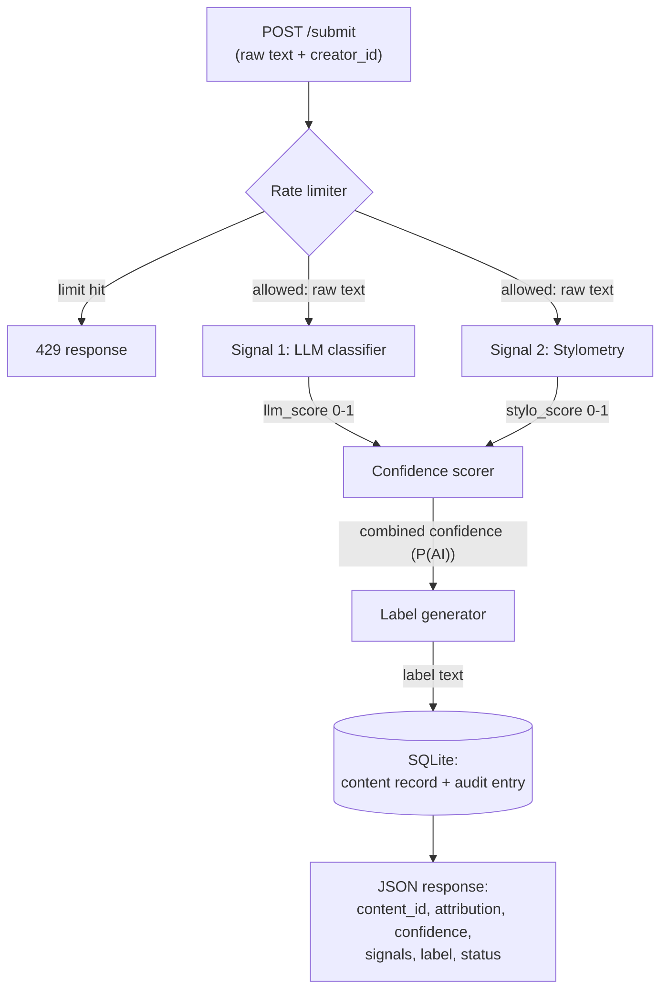
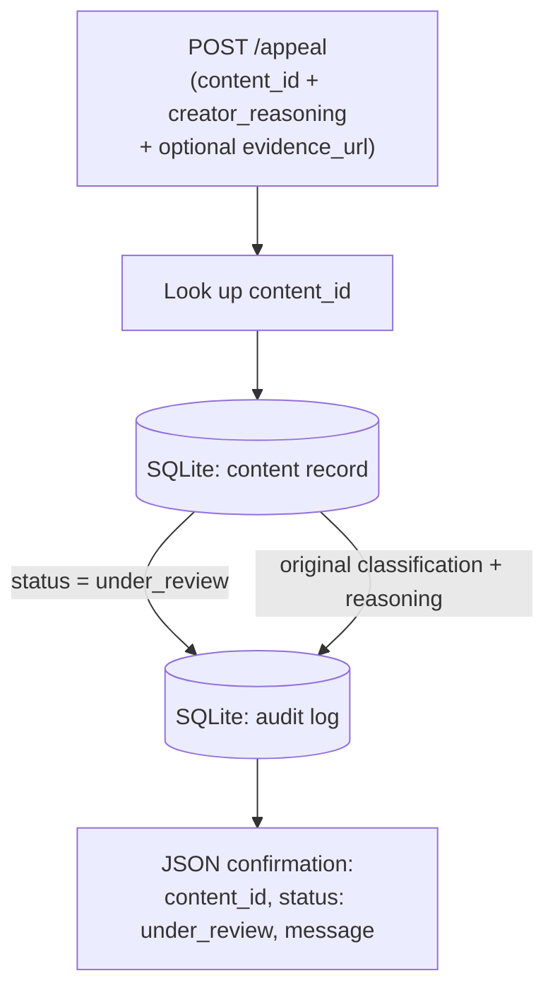
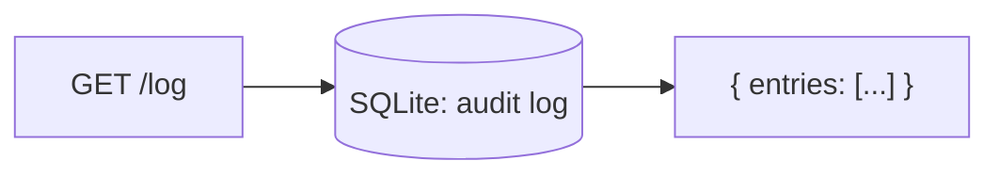

# Provenance Guard Planning

In this project, we will develop Provenance Guard, a backend plug-in for creative-sharing platforms to classify whether user-submitted text was likely written by a human or generated by AI.

## Architecture

**Submission flow**

**Appeal flow**

**Documentation endpoint**

## Detection Signals

### Signal 1: LLM classifier (semantic)

Groq `llama-3.3-70b-versatile` reads the text and judges how AI it sounds, weighing semantic and stylistic coherence holistically.

The signal returns structured JSON via JSON mode, `{ "llm_score": 0.0-1.0, "reason": "<one sentence>" }`, where `llm_score` is the model's estimated probability that the text is AI-generated.

A parse failure triggers a retry with the fallback model `openai/gpt-oss-120b`. If that also fails, the signal treats the text as uncertain (`llm_score = 0.5`) and logs the failure.

**Potential blind spot**

This signal is steerable by framing, fooled by lightly-edited AI or an unusual-but-genuine human voice, and non-deterministic across calls.

### Signal 2: Stylometric heuristics (structural)

Pure-Python heuristics measure how statistically regular the text is. Three metrics each map to a 0-1 AI-leaning sub-score and average into one `stylo_score`:

1. Sentence-length variance

    AI is more uniform. Low variance leans AI.

2. Type-token ratio (unique / total words)

    AI repeats common phrasing. Low TTR leans AI.

3. Punctuation density

   Informal human writing is more expressive. Low variation leans AI.

Models optimize for coherent, uniform output, so this structural regularity separates them from naturally variable human writing.

**Potential blind spot**

This signal cannot read meaning, and it penalizes legitimately uniform or formal human writing such as academic prose or non-native English. It is also unreliable on very short texts.

## Confidence Scoring and Uncertainty Representation

A single `confidence` value in `[0, 1]` is the system's confidence that the content is AI-generated: `0.0` is certainly human, `0.5` is maximally uncertain, and `1.0` is certainly AI. It is a weighted average that trusts the holistic signal more, so stylometry informs the result but cannot dominate it:

$$\text{confidence} = 0.7 \cdot \text{llm\_score} + 0.3 \cdot \text{stylo\_score}$$

The transparency label is a direct function of this one number, so a `0.51` and a `0.95` produce different labels, not just different numbers. Three bands map the score to a label:

| `confidence` | Band (`attribution`) | Meaning |
| :--- | :--- | :--- |
| Under `0.35` | `likely_human` | confident human |
| `0.35 - 0.70` | `uncertain` | inconclusive |
| Over `0.70` | `likely_ai` | confident AI |

The bands are asymmetric on purpose: it takes strong evidence to call something AI, so a borderline score like `0.68` lands in Uncertain rather than accusing a human. The three bands also serve as confidence tiers, where likely human and likely AI are the confident outcomes and Uncertain is the near-`0.5` middle.

The word `confidence` here means confidence that the content is AI-generated, not confidence in the verdict, so a strongly-human result reads as a low number such as `0.08` under the `likely_human` label. End users see only the plain-language label, never this raw number.

To validate the scoring, I will run the four spec test inputs (clearly AI, clearly human, formal-human borderline, and lightly-edited-AI borderline) and confirm that the clearly-AI and clearly-human cases land in opposite bands while the borderline cases land in Uncertain. If they do not, I will print both signal scores separately to find which one is misbehaving before adjusting the reference windows. The README's two-example demo will pair a confident case (`~0.9`) with an uncertain one (`~0.52`) to show the score varies meaningfully.

## Transparency Labels

Three variants, selected by band:

| Band | Label text |
| :--- | :--- |
| `likely_ai` | 🤖 Likely AI-generated. Our analysis suggests this text was probably produced with significant help from an AI writing tool. This is an automated estimate, not a certainty. If you wrote it yourself, you can appeal. |
| `uncertain` | ❓ Inconclusive. Human writing like an AI, or AI writing like a human? You've got us, no verdict on this one. |
| `likely_human` | ✍️ Likely human-written. Our analysis found no strong signs of AI generation in this text. |

## Appeals Workflow

A creator can appeal their own classified submission by sending its `content_id` (returned by `/submit`) together with `creator_reasoning`, a free-text explanation of why they believe the classification is wrong. They may optionally include an `evidence_url` pointing to a Google Docs or OneDrive document that shows the full editing history.

The system validates that the `content_id` exists, sets the content record's `status` to `under_review`, appends an audit-log entry that references the original classification with the reasoning, any evidence link, and a timestamp, and returns a confirmation.

There is no automated re-classification. A reviewer opening the queue sees, through `GET /log`, the original classification entry (attribution, confidence, signal scores, timestamp) along with the appeal entry (`creator_reasoning`, `evidence_url`, timestamp, `under_review`) for that `content_id`.

## Storage and Audit Log

SQLite, one file, two tables.

- **`content`** (one mutable row per submission): `content_id` (PK), `creator_id`, `text`, `attribution`, `confidence`, `llm_score`, `stylo_score`, `label`, `status` (`classified` → `under_review`), `created_at`, `updated_at`.
- **`audit_log`** (append-only, one row per event): `content_id`, `creator_id`, `timestamp`, `event` (`classification` | `appeal`), `attribution`, `confidence`, `llm_score`, `stylo_score`, `status`, `appeal_reasoning`, `appeal_evidence_url` (the last two are null except on appeal events).

A `classification` row is written on every `/submit`, and an `appeal` row is appended on every `/appeal` with the same `content_id`, so `GET /log` shows the appeal beside the original classification. Each entry carries the attribution, `confidence`, and `timestamp` the audit requirement calls for, and both signal scores are kept so the combined `confidence` is reconstructable.

## Anticipated Edge Cases

1. Formal prose by a non-native English speaker or academic writing.

   Low sentence-length variance and lower TTR drive the stylometry score high, and the even, formal register can nudge the LLM up too, so the combined score can creep toward the AI band even though a human wrote it. This is the exact case the asymmetric 0.70 threshold and the appeal path are designed to catch.

2. Very short submissions

   Variance and TTR are statistically meaningless on a handful of tokens, so the stylometry score is unstable and the verdict unreliable for a haiku, a one-sentence caption, etc. The system should lean *Uncertain* here rather than commit.

3. Heavily repetitive, simple-vocabulary poetry.

   Intentional repetition and a small word set crush the TTR and variance, reading as "uniform" to stylometry and producing a false AI lean, a structural blind spot that no amount of semantic reading from the LLM fully offsets.

## AI Tool Plan

AI tools generate code in all three implementation milestones. Each time, I provide the relevant spec sections plus the Architecture diagram above, and I verify the output before wiring it in.

### Milestone 3

I will give the Detection Signals section (Signal 1) and the Architecture diagram, and ask for the Flask app skeleton with a `POST /submit` route stub and the LLM signal function returning `{llm_score, reason}`.

I will verify by calling the signal function directly on a few inputs to confirm it returns a 0-1 score rather than a label, then confirm the route matches the API contract before wiring it in.

### Milestone 4

I will give the Detection Signals (Signal 2) and Confidence Scoring sections plus the diagram, and ask for the stylometry function and the scoring logic that combines both signals.

I will verify that the generated scoring uses the weights and the thresholds exactly as specified, since AI tools often drift here, then run the four test inputs to check the scores vary as intended.

### Milestone 5

I will give the Transparency Labels and Appeals Workflow sections plus the diagram, and ask for the label-generation function (band to label text) and the `POST /appeal` endpoint.

I will verify by having the tool emit all three label variants and confirming the text matches this document, then confirm an appeal flips status to `under_review` and logs alongside the original entry.

## Stretch Features

### Ensemble detection

The pipeline already combines more than two distinct signals, so it is an ensemble. The LLM classifier is one signal, and stylometry is three independent structural signals, sentence-length variance, type-token ratio, and punctuation density, each scored separately before they combine.

The signals combine by a hierarchical weighted average. The three stylometric signals first combine into `stylo_score` with a 3:2:3 weighting (variance `0.375`, TTR `0.25`, punctuation `0.375`), then `stylo_score` combines with the LLM:

`confidence = 0.7 * llm_score + 0.3 * stylo_score`

so the effective ensemble weights are LLM `0.70`, variance `0.1125`, punctuation `0.1125`, and TTR `0.075`.

Conflicts are resolved by weight and by the asymmetric bands. The LLM holds the majority weight because it is the only signal that reads meaning, so no single structural signal can flip its verdict. A structural signal that disagrees with the LLM pulls a borderline result toward Uncertain rather than reversing it, and the `0.70` threshold keeps a contested case out of `likely_ai` and favors the human. TTR carries the smallest weight because it saturates on short text and is the least reliable of the three.

Each signal is scored separately (`llm_score` and the three stylometric sub-scores in `signal_stylometry`). As part of this stretch, `/submit` exposes them in an additive `ensemble_signals` field, and the README shows the full breakdown alongside the combined `confidence`.

### Analytics dashboard

A read-only `GET /analytics` endpoint that aggregates the existing `audit_log` and returns a JSON summary with three metrics:

1. **Detection pattern**: the share of `likely_ai`, `uncertain`, and `likely_human` verdicts across all classifications.
2. **Appeal rate**: appeals divided by classifications.
3. **Average confidence**: the mean confidence across all classifications.
